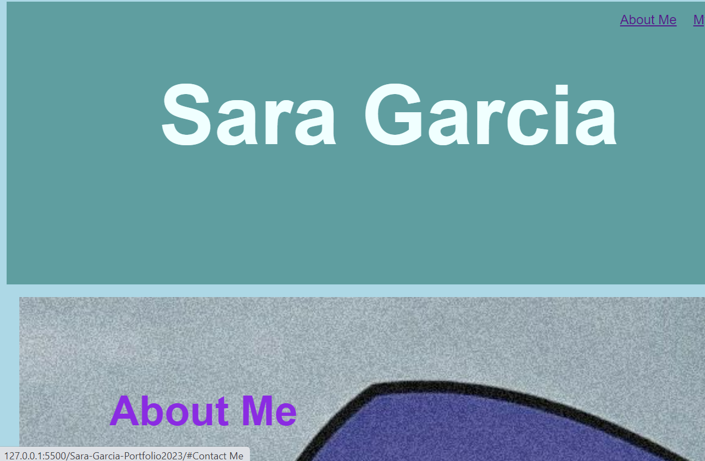
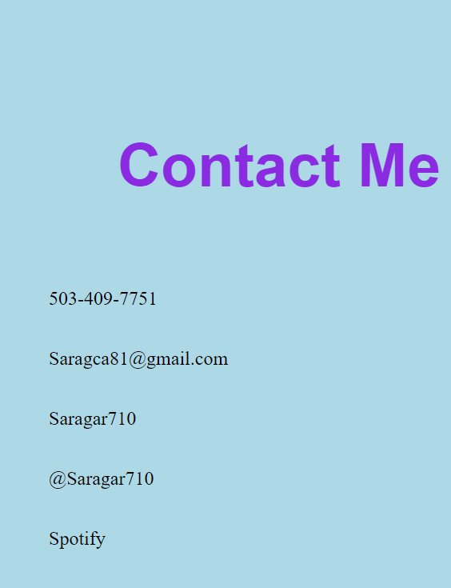

# Sara-Garcia-Portfolio2023

## Description
This project was very difficult for me. We did not have a started code and that proved to be a little tricky. While I am still slightly confused as to what elements go where and the difference between classes, I think I did pretty well. Not outstanding by no means, but with help and guidance I know that in a few weeks I am going to look back on how I struggled with this assignment and laugh. I know in the future I will need a much more professional portfolio, but searching for these pictures and trying to decide which ones would work was fun. As you can see I struggled to figure out how to resize the pictures to get them in the box, even how to build the box was hard. One day a potential employer will see my profile(the on I have updated) and they will see I am a good fit for the job. 

## Usage

## Credits
I would like to give a shout out to the TA's for their guidance and patients. As well as Stanley Lewis for being awesome and a great teacher. 

## License
N/A

## Badges
N/A at this time

## Features
Not quite sure what this is.

